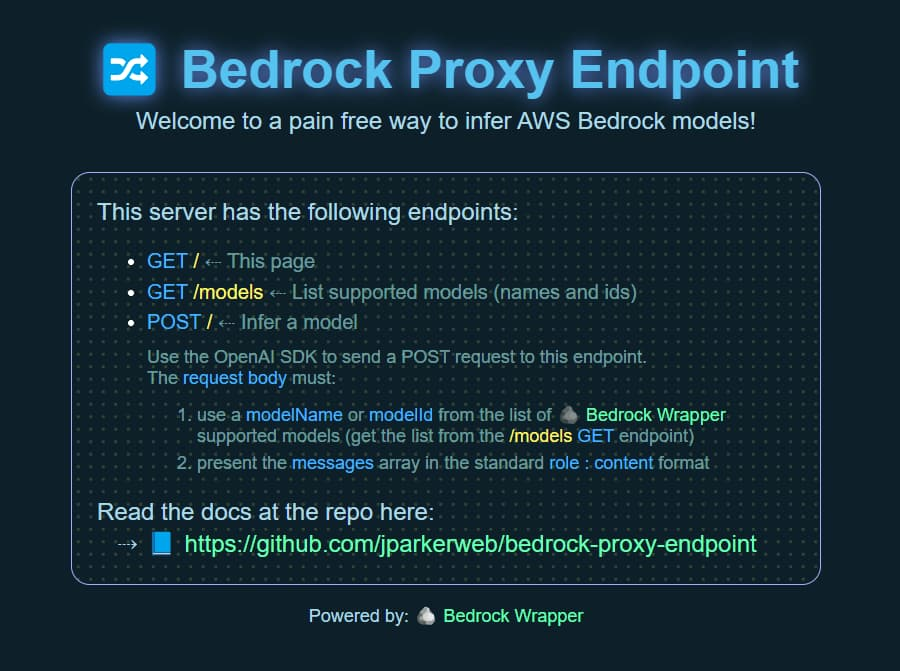

# 🪨 Bedrock Wrapper
Bedrock Wrapper is an npm package that simplifies the integration of existing OpenAI-compatible API objects with AWS Bedrock's serverless inference LLMs.  Follow the steps below to integrate into your own application, or alternativly use the 🪨 [Bedrock Proxy Endpoint](https://github.com/jparkerweb/bedrock-proxy-endpoint) project to spin up your own custom OpenAI server endpoint for even easier inference (using the standard `baseUrl`, and `apiKey` params).

---

### Install

- install package: `npm install bedrock-wrapper`

---

### Usage

1. import `bedrockWrapper`  
    ```javascript
    import { bedrockWrapper } from "bedrock-wrapper";
    ```

2. create an `awsCreds` object and fill in your AWS credentials  
    ```javascript
    const awsCreds = {
        region: AWS_REGION,
        accessKeyId: AWS_ACCESS_KEY_ID,
        secretAccessKey: AWS_SECRET_ACCESS_KEY,
    };
    ```

3. clone your openai chat completions object into `openaiChatCompletionsCreateObject` or create a new one and edit the values  
    ```javascript
    const openaiChatCompletionsCreateObject = {
        "messages": messages,
        "model": "Llama-3-8b",
        "max_tokens": LLM_MAX_GEN_TOKENS,
        "stream": true,
        "temperature": LLM_TEMPERATURE,
        "top_p": LLM_TOP_P,
    };
    ```

    the `messages` variable should be in openai's role/content format  
    ```javascript
    messages = [
        {
            role: "system",
            content: "You are a helpful AI assistant that follows instructions extremely well. Answer the user questions accurately. Think step by step before answering the question. You will get a $100 tip if you provide the correct answer.",
        },
        {
            role: "user",
            content: "Describe why openai api standard used by lots of serverless LLM api providers is better than aws bedrock invoke api offered by aws bedrock. Limit your response to five sentences.",
        },
        {
            role: "assistant",
            content: "",
        },
    ]
    ```

    ***the `model` value should be either a corresponding `modelName` or `modelId` for the supported `bedrock_models` (see the Supported Models section below)***

4. call the `bedrockWrapper` function and pass in the previously defined `awsCreds` and `openaiChatCompletionsCreateObject` objects  
    ```javascript
    // create a variable to hold the complete response
    let completeResponse = "";
    // invoke the streamed bedrock api response
    for await (const chunk of bedrockWrapper(awsCreds, openaiChatCompletionsCreateObject)) {
        completeResponse += chunk;
        // ---------------------------------------------------
        // -- each chunk is streamed as it is received here --
        // ---------------------------------------------------
        process.stdout.write(chunk); // ⇠ do stuff with the streamed chunk
    }
    // console.log(`\n\completeResponse:\n${completeResponse}\n`); // ⇠ optional do stuff with the complete response returned from the API reguardless of stream or not
    ```

    if calling the unstreamed version you can call bedrockWrapper like this  
    ```javascript
    // create a variable to hold the complete response
    let completeResponse = "";
    // invoke the streamed bedrock api response
    if (!openaiChatCompletionsCreateObject.stream){ // invoke the unstreamed bedrock api response
        const response = await bedrockWrapper(awsCreds, openaiChatCompletionsCreateObject);
        for await (const data of response) {
            const jsonString = new TextDecoder().decode(data.body);
            const jsonResponse = JSON.parse(jsonString);
            completeResponse += jsonResponse.generation;
        }
        // ----------------------------------------------------
        // -- unstreamed complete response is available here --
        // ----------------------------------------------------
        console.log(`\n\completeResponse:\n${completeResponse}\n`); // ⇠ do stuff with the complete response
    }

---

### Supported Models

| modelName      | modelId                            |
|----------------|------------------------------------|
| Llama-3-8b     | meta.llama3-8b-instruct-v1:0       |
| Llama-3-70b    | meta.llama3-70b-instruct-v1:0      |
| Mixtral-8x7b   | mistral.mixtral-8x7b-instruct-v0:1 |
| Mistral-Large  | mistral.mistral-large-2402-v1:0    |

To return the list progrmatically you can import and call `listBedrockWrapperSupportedModels`:  
```javascript
import { listBedrockWrapperSupportedModels } from 'bedrock-wrapper';
console.log(`\nsupported models:\n${JSON.stringify(await listBedrockWrapperSupportedModels())}\n`);
```

Additional Bedrock model support can be added.  
Please modify the `bedrock_models.js` file and submit a PR 🏆 or create an Issue.

---

### 📢 P.S.

In case you missed it at the beginning of this doc, for an even easier setup, use the 🔀 [Bedrock Proxy Endpoint](https://github.com/jparkerweb/bedrock-proxy-endpoint) project to spin up your own custom OpenAI server endpoint (using the standard `baseUrl`, and `apiKey` params).

